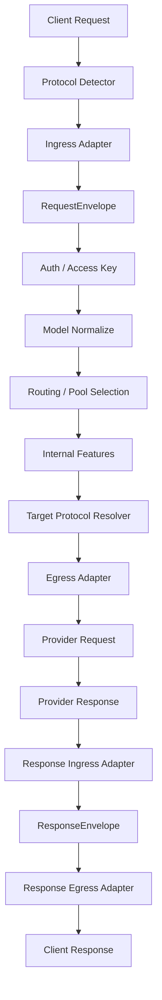
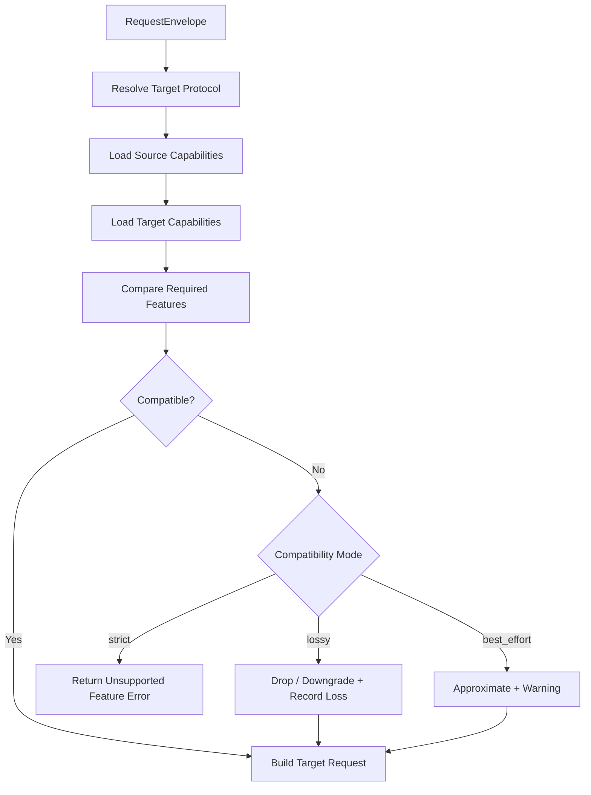

# 多协议翻译中间层设计

## 目标

API Switch 的协议翻译层需要同时支持 OpenAI Chat Completions、OpenAI Responses、Claude Messages、Gemini GenerateContent、Azure OpenAI 等主流协议，并保留项目自身位于中间层的路由、策略、审计、回退、协议补偿等特色能力。

本设计的核心目标是：

- 入口识别并标注来源协议。
- 出口根据目标协议做定向翻译和裁剪。
- 不建立庞大的万能中间协议。
- 不把 OpenAI Chat 作为唯一内部标准，避免过早丢失 Responses、Claude、Gemini 等协议特性。
- 保留原始请求体，确保出口翻译时仍有完整依据。
- 对不兼容字段明确记录为丢弃、降级、近似或报错。

一句话总结：

> 使用“源协议标注 + 原始体保留 + 轻量归一化 Envelope + 出口按目标协议裁剪”的架构，而不是两两协议互转，也不是超级中间协议。

---

## 核心原则

### 1. 不做大一统协议

不要设计一个试图完整表达所有协议能力的超级协议。各协议之间不是字段名不同，而是语义模型不同：

- OpenAI Chat Completions 使用 `messages`、`tools`、`tool_choice`、`response_format`。
- OpenAI Responses 使用 `input`、`instructions`、`previous_response_id`、`reasoning`、`text.format`。
- Claude Messages 使用顶层 `system`、`messages.content[]`、`thinking`、`tool_use`。
- Gemini 使用 `contents[]`、`parts[]`、`systemInstruction`、`generationConfig`。
- Azure OpenAI 还存在 deployment 与 model 的差异。

中间层只负责轻量归一化、能力标注、内部策略承载和损耗记录，不负责表达所有协议的完整细节。

### 2. 保留原始请求

入口适配器必须保留完整原始请求：

```ts
original: {
  headers: Record<string, string>;
  path: string;
  query: Record<string, string>;
  body: unknown;
}
```

这样出口翻译时可以根据 `source.protocol`、`target.protocol` 和 `original.body` 做更准确的定向转换。

### 3. 中间层服务项目特色能力

项目自己的特色能力不应绑死在某个外部协议结构上，而应放入 `internal` 上下文。

例如智能路由、模型别名改写、失败回退、协议补偿、审计标签、兼容模式、调试链路等，都应挂在 `internal` 下，而不是寄生在 OpenAI/Claude/Gemini 的原始 JSON 结构里。

### 4. 不兼容必须可观测

协议转换中不可避免会遇到不兼容字段。不能静默丢弃，应统一记录：

- `drop`：目标协议不支持，直接丢弃。
- `downgrade`：降级成目标协议可表达的形式。
- `approximate`：近似转换。
- `move_to_metadata`：转移到 metadata 或 internal 中。
- `error`：严格模式下直接报错。

---

## 总体架构



请求链路：

```text
客户端协议 -> 入口适配器 -> RequestEnvelope -> 路由/策略/特色能力 -> 出口适配器 -> 上游 Provider 协议
```

响应链路：

```text
上游 Provider 协议 -> 响应入口适配器 -> ResponseEnvelope -> 响应出口适配器 -> 客户端协议
```

---

## 协议分类

建议先支持以下协议：

```ts
type Protocol =
  | "openai_chat"
  | "openai_responses"
  | "azure_openai_chat"
  | "azure_openai_responses"
  | "claude_messages"
  | "gemini_generate_content"
  | "unknown";
```

协议识别可基于路由、请求体和 Header 综合判断。

| 协议 | 典型路由 | 主要特征 |
| --- | --- | --- |
| OpenAI Chat | `/v1/chat/completions` | body 有 `messages` |
| OpenAI Responses | `/v1/responses` | body 有 `input` |
| Azure Chat | `/openai/deployments/{deployment}/chat/completions` | path 有 `deployments` |
| Azure Responses | `/openai/deployments/{deployment}/responses` | path 有 `deployments` + `responses` |
| Claude Messages | `/v1/messages` | body 有 `messages`，顶层可能有 `system` |
| Gemini GenerateContent | `/v1beta/models/{model}:generateContent` | body 有 `contents` |
| Gemini Stream | `/streamGenerateContent` | streaming endpoint |

---

## RequestEnvelope

```ts
interface RequestEnvelope {
  id: string;
  source: ProtocolEndpoint;
  target?: ProtocolEndpoint;
  original: OriginalRequest;
  normalized: NormalizedRequest;
  capabilities: RequestCapabilities;
  compatibility: CompatibilityState;
  internal: InternalContext;
  timing: {
    receivedAt: number;
  };
}
```

### ProtocolEndpoint

```ts
interface ProtocolEndpoint {
  protocol: Protocol;
  vendor?: "openai" | "azure" | "anthropic" | "google" | "custom";
  apiType?: "openai" | "responses" | "claude" | "gemini" | "azure" | "custom";
  routeKind?: "chat" | "responses" | "messages" | "generateContent" | "models";
  model?: string;
  deployment?: string;
}
```

示例：

```ts
source: {
  protocol: "openai_responses",
  vendor: "openai",
  routeKind: "responses",
  model: "gpt-5.1"
}
```

```ts
target: {
  protocol: "claude_messages",
  vendor: "anthropic",
  routeKind: "messages",
  model: "claude-sonnet-4-5"
}
```

---

## NormalizedRequest

NormalizedRequest 是轻量归一化结果，只承载中间层必须理解的公共语义。

```ts
interface NormalizedRequest {
  model?: string;
  input: NormalizedInput;
  instructions?: NormalizedInstruction[];
  stream: boolean;
  tools: NormalizedTool[];
  toolChoice?: NormalizedToolChoice;
  generation: NormalizedGenerationConfig;
  responseFormat?: NormalizedResponseFormat;
  reasoning?: NormalizedReasoningConfig;
  conversation?: NormalizedConversationState;
  metadata: Record<string, unknown>;
}
```

### NormalizedInput

```ts
interface NormalizedInput {
  messages: NormalizedMessage[];
}
```

```ts
interface NormalizedMessage {
  role: "system" | "developer" | "user" | "assistant" | "tool" | "model" | "unknown";
  content: NormalizedContentPart[];
  name?: string;
  toolCallId?: string;
  sourceRole: string;
  sourceIndex: number;
  metadata?: Record<string, unknown>;
}
```

```ts
type NormalizedContentPart =
  | TextPart
  | ImagePart
  | AudioPart
  | VideoPart
  | FilePart
  | ToolCallPart
  | ToolResultPart
  | ReasoningPart
  | UnknownPart;
```

```ts
interface TextPart {
  type: "text";
  text: string;
}

interface ImagePart {
  type: "image";
  mimeType?: string;
  url?: string;
  base64?: string;
  detail?: "low" | "high" | "auto";
}

interface ToolCallPart {
  type: "tool_call";
  id: string;
  name: string;
  arguments: unknown;
}

interface ToolResultPart {
  type: "tool_result";
  toolCallId: string;
  content: NormalizedContentPart[];
  isError?: boolean;
}

interface UnknownPart {
  type: "unknown";
  sourceType: string;
  raw: unknown;
}
```

`UnknownPart` 很重要。遇到暂不支持的内容不要入口阶段直接丢弃，应保留给出口适配器判断是否可转换、降级、丢弃或报错。

---

## Instructions

不同协议的系统提示位置不同：

| 协议 | 系统提示位置 |
| --- | --- |
| OpenAI Chat | `messages[{ role: "system" }]` 或 `developer` |
| OpenAI Responses | `instructions` 或 `input` |
| Claude | 顶层 `system` |
| Gemini | `systemInstruction` |

建议抽象成：

```ts
interface NormalizedInstruction {
  role: "system" | "developer" | "policy";
  content: NormalizedContentPart[];
  source: "body" | "injected" | "internal";
  priority: number;
}
```

项目自己的系统提示注入应加入 `instructions`，不要直接改某个协议的原始 messages。出口适配器再负责落到目标协议支持的位置。

---

## GenerationConfig

```ts
interface NormalizedGenerationConfig {
  temperature?: number;
  topP?: number;
  topK?: number;
  maxOutputTokens?: number;
  stop?: string[];
  seed?: number;
  presencePenalty?: number;
  frequencyPenalty?: number;
  logprobs?: boolean;
  topLogprobs?: number;
}
```

| 字段 | OpenAI Chat | Responses | Claude | Gemini |
| --- | --- | --- | --- | --- |
| temperature | 支持 | 支持 | 支持 | 支持 |
| top_p | 支持 | 支持 | 支持 | 支持 |
| top_k | 不支持 | 不支持 | 支持 | 支持 |
| max tokens | `max_tokens` / `max_completion_tokens` | `max_output_tokens` | `max_tokens` | `maxOutputTokens` |
| stop | 支持 | 支持 | 支持 | 支持 |
| seed | 部分支持 | 部分支持 | 不支持 | 不支持 |
| logprobs | 支持程度依模型而定 | 支持程度依模型而定 | 不支持 | 不支持 |

目标协议不支持的字段应写入 `compatibility.losses`。

---

## ReasoningConfig

```ts
interface NormalizedReasoningConfig {
  enabled?: boolean;
  effort?: "minimal" | "low" | "medium" | "high";
  budgetTokens?: number;
  summary?: "auto" | "concise" | "detailed" | "none";
  raw?: unknown;
}
```

| 来源 | 目标 | 处理建议 |
| --- | --- | --- |
| Responses reasoning | OpenAI Chat | 目标模型支持才转，否则丢弃并记录 |
| Claude thinking | Responses | 可转为 `reasoning` |
| Gemini thinkingConfig | Responses | 可转为 `effort` 或 `budgetTokens` |
| OpenAI Chat 无 reasoning | Claude | 不主动注入 |

---

## Tools

```ts
interface NormalizedTool {
  type: "function" | "web_search" | "code_interpreter" | "computer_use" | "unknown";
  name: string;
  description?: string;
  inputSchema?: unknown;
  sourceType: string;
  raw?: unknown;
}
```

```ts
interface NormalizedToolChoice {
  mode: "auto" | "none" | "required" | "specific";
  name?: string;
  raw?: unknown;
}
```

| 来源 | 目标 | 策略 |
| --- | --- | --- |
| OpenAI Chat function tool | Claude | 转 Claude `tools` |
| Claude tool | OpenAI Chat | 转 `tools: [{ type: "function" }]` |
| Gemini functionDeclarations | OpenAI Chat | 转 function tool |
| Responses built-in tools | Chat | 不支持的 built-in tool 丢弃或报错 |
| Web search / file search / computer use | 任意目标 | 依能力矩阵判断 |

---

## ResponseFormat

```ts
interface NormalizedResponseFormat {
  type: "text" | "json_object" | "json_schema";
  schema?: unknown;
  strict?: boolean;
  raw?: unknown;
}
```

| 目标协议 | 映射方式 |
| --- | --- |
| OpenAI Chat | `response_format` |
| OpenAI Responses | `text.format` |
| Claude | 可转工具 schema 或提示词约束 |
| Gemini | `generationConfig.responseMimeType` + `responseSchema` |

Claude 对严格 JSON Schema 的直接支持较弱，应记录降级：

```ts
compatibility.losses.push({
  field: "responseFormat.schema",
  sourceProtocol: "openai_chat",
  targetProtocol: "claude_messages",
  reason: "target protocol does not support strict json_schema directly",
  action: "downgrade"
});
```

---

## ConversationState

```ts
interface NormalizedConversationState {
  previousResponseId?: string;
  conversationId?: string;
  store?: boolean;
  raw?: unknown;
}
```

| 来源 | 目标 | 策略 |
| --- | --- | --- |
| Responses | Responses | 保留 `previous_response_id` |
| Responses | Chat | 丢弃或由内部会话系统补齐 |
| Responses | Claude | 丢弃或转 internal metadata |
| Chat | Responses | 无 `previous_response_id`，正常为空 |

---

## CompatibilityState

```ts
interface CompatibilityState {
  mode: "strict" | "lossy" | "best_effort";
  losses: CompatibilityLoss[];
  warnings: CompatibilityWarning[];
  unsupported: UnsupportedFeature[];
}
```

```ts
interface CompatibilityLoss {
  field: string;
  sourceProtocol: Protocol;
  targetProtocol: Protocol;
  reason: string;
  action: "drop" | "downgrade" | "approximate" | "move_to_metadata";
}
```

```ts
interface UnsupportedFeature {
  feature: string;
  severity: "error" | "warning";
  message: string;
}
```

三种兼容模式：

| 模式 | 行为 |
| --- | --- |
| `strict` | 只要出现不可兼容字段就报错 |
| `lossy` | 允许丢弃或降级，但必须记录日志 |
| `best_effort` | 尽量转换，不兼容就近似或转提示 |

默认建议使用 `lossy`，调试和企业严格场景使用 `strict`。

---

## InternalContext

`InternalContext` 用来承载 API Switch 自己的中间层特色能力。

```ts
interface InternalContext {
  requestId: string;

  auth?: {
    accessKeyId?: string;
    accessKeyName?: string;
    tokenName?: string;
  };

  routing: {
    requestedModel?: string;
    normalizedModel?: string;
    selectedModel?: string;
    selectedEntryId?: string;
    selectedChannelId?: string;
    selectedApiType?: string;
    groupName?: string;
    routeReason?: string;
    failoverAttempt?: number;
  };

  policy: {
    routePolicy?: string;
    sortMode?: "custom" | "latest" | "fastest";
    compatibilityMode?: "strict" | "lossy" | "best_effort";
    allowToolDowngrade?: boolean;
    allowMultimodalDowngrade?: boolean;
  };

  features: {
    injectSystemPrompt?: boolean;
    modelAliasRewrite?: boolean;
    autoFallback?: boolean;
    translateProtocol?: boolean;
    showConversationModel?: boolean;
  };

  audit: {
    labels: string[];
    notes: string[];
  };

  debug?: {
    ingressProtocolDetectedBy?: string;
    selectedTranslator?: string;
    translationSteps?: string[];
  };
}
```

原则：

- 特色能力依赖 `internal + normalized`。
- 协议兼容依赖 `source + target + original`。
- 不可丢的信息放 `original`。
- 内部决策痕迹放 `internal`。

---

## 入口适配器

```ts
interface IngressAdapter {
  detect(req: HttpRequest): boolean;
  parse(req: HttpRequest): Promise<RequestEnvelope>;
}
```

### OpenAI Chat Ingress

| OpenAI Chat | Envelope |
| --- | --- |
| `model` | `normalized.model` |
| `messages` | `normalized.input.messages` |
| `stream` | `normalized.stream` |
| `tools` | `normalized.tools` |
| `tool_choice` | `normalized.toolChoice` |
| `response_format` | `normalized.responseFormat` |
| `temperature/top_p/stop` | `normalized.generation` |

### OpenAI Responses Ingress

| Responses | Envelope |
| --- | --- |
| `model` | `normalized.model` |
| `instructions` | `normalized.instructions` |
| `input` | `normalized.input.messages` |
| `reasoning` | `normalized.reasoning` |
| `tools` | `normalized.tools` |
| `text.format` | `normalized.responseFormat` |
| `previous_response_id` | `normalized.conversation.previousResponseId` |
| `stream` | `normalized.stream` |

注意：Responses 的 `input` 可能是 string，也可能是 array；array 内可能包含 message、tool result、多模态内容，不能简单等同于 Chat 的 `messages`。

### Claude Messages Ingress

| Claude | Envelope |
| --- | --- |
| `model` | `normalized.model` |
| `system` | `normalized.instructions` |
| `messages` | `normalized.input.messages` |
| `tools` | `normalized.tools` |
| `tool_choice` | `normalized.toolChoice` |
| `thinking` | `normalized.reasoning` |
| `max_tokens` | `normalized.generation.maxOutputTokens` |
| `temperature/top_p/top_k` | `normalized.generation` |

### Gemini Ingress

| Gemini | Envelope |
| --- | --- |
| path model | `normalized.model` |
| `contents` | `normalized.input.messages` |
| `systemInstruction` | `normalized.instructions` |
| `tools.functionDeclarations` | `normalized.tools` |
| `generationConfig` | `normalized.generation` |
| `safetySettings` | `metadata.safetySettings` |
| `cachedContent` | `metadata.cachedContent` |

---

## 出口适配器

```ts
interface EgressAdapter {
  supports(target: ProtocolEndpoint): boolean;
  buildRequest(envelope: RequestEnvelope): Promise<HttpRequest>;
}
```

出口适配器根据以下信息生成目标协议请求：

- `source.protocol`
- `target.protocol`
- `original.body`
- `normalized`
- `compatibility.mode`
- `internal.policy`

### Responses -> OpenAI Chat

可保留：

| Responses | OpenAI Chat |
| --- | --- |
| `model` | `model` |
| `input` | `messages` |
| `instructions` | system/developer message |
| function tools | `tools` |
| `tool_choice` | `tool_choice` |
| `stream` | `stream` |
| `temperature/top_p` | 对应字段 |

应丢弃或降级：

| Responses 字段 | 处理 |
| --- | --- |
| `previous_response_id` | Chat 不支持，丢弃或转 internal |
| `store` | Chat 不支持，丢弃 |
| `reasoning` | 目标 Chat 模型不支持则丢弃 |
| built-in tools | Chat 不支持的工具丢弃或报错 |
| `text.format` | 转 `response_format`，不支持则降级 |
| `include` | 多数 Chat 不支持，丢弃 |

### OpenAI Chat -> Responses

| Chat | Responses |
| --- | --- |
| `model` | `model` |
| `messages` | `input` |
| system/developer messages | `instructions` 或 `input` |
| `tools` | `tools` |
| `tool_choice` | `tool_choice` |
| `response_format` | `text.format` |
| `stream` | `stream` |

Chat 的 `messages` 应整体转换为 Responses `input` array，不应简单拼成字符串。

### Claude -> OpenAI Chat

| Claude | OpenAI Chat |
| --- | --- |
| `system` | system message |
| `messages` | `messages` |
| content text | text content |
| image content | image content |
| `tools` | function tools |
| `tool_choice` | `tool_choice` |
| `thinking` | 目标支持才转，否则丢弃 |
| `max_tokens` | `max_tokens` 或 `max_completion_tokens` |

Claude 的 `tool_use` content block 需要专门转成 OpenAI Chat 的 `tool_calls`。

### OpenAI Chat -> Claude

| OpenAI Chat | Claude |
| --- | --- |
| system message | 顶层 `system` |
| user/assistant messages | `messages` |
| tool_calls | assistant content block `tool_use` |
| tool result | user content block `tool_result` |
| tools | Claude `tools` |
| response_format | 降级为 system instruction 或 tool schema |

Claude 不接受 `system` 作为普通 message，应提升到顶层。

### Gemini -> OpenAI Chat

| Gemini | OpenAI Chat |
| --- | --- |
| `contents[].role=user` | user message |
| `contents[].role=model` | assistant message |
| `parts[].text` | text |
| `parts[].inlineData` | image/audio/file |
| `functionCall` | tool call |
| `functionResponse` | tool result |
| `systemInstruction` | system message |

### OpenAI Chat -> Gemini

| OpenAI Chat | Gemini |
| --- | --- |
| system message | `systemInstruction` |
| user message | `contents.role=user` |
| assistant message | `contents.role=model` |
| text content | `parts.text` |
| image_url/base64 | `parts.inlineData` 或 `fileData` |
| tool_calls | `functionCall` |
| tool result | `functionResponse` |
| tools | `tools.functionDeclarations` |

---

## ResponseEnvelope

```ts
interface ResponseEnvelope {
  id: string;
  source: ProtocolEndpoint;
  target: ProtocolEndpoint;
  original: {
    status: number;
    headers: Record<string, string>;
    body?: unknown;
    stream?: unknown;
  };
  normalized: NormalizedResponse;
  compatibility: CompatibilityState;
  internal: InternalResponseContext;
  timing: {
    startedAt: number;
    firstTokenAt?: number;
    completedAt?: number;
  };
}
```

```ts
interface NormalizedResponse {
  id?: string;
  model?: string;
  output: NormalizedOutputItem[];
  stopReason?: NormalizedStopReason;
  usage?: NormalizedUsage;
  stream: boolean;
  metadata: Record<string, unknown>;
}
```

```ts
type NormalizedOutputItem =
  | ResponseMessageItem
  | ResponseToolCallItem
  | ResponseReasoningItem
  | ResponseErrorItem;
```

```ts
interface ResponseMessageItem {
  type: "message";
  role: "assistant";
  content: NormalizedContentPart[];
}

interface NormalizedUsage {
  inputTokens?: number;
  outputTokens?: number;
  totalTokens?: number;
  reasoningTokens?: number;
  cachedInputTokens?: number;
  raw?: unknown;
}
```

---

## Streaming

Streaming 不建议强行统一成某个外部协议格式。内部应使用事件流：

```ts
type StreamEvent =
  | StreamStartEvent
  | StreamTextDeltaEvent
  | StreamToolCallDeltaEvent
  | StreamReasoningDeltaEvent
  | StreamUsageEvent
  | StreamEndEvent
  | StreamErrorEvent;
```

```ts
interface StreamTextDeltaEvent {
  type: "text_delta";
  index: number;
  delta: string;
}

interface StreamToolCallDeltaEvent {
  type: "tool_call_delta";
  index: number;
  id?: string;
  name?: string;
  argumentsDelta?: string;
}

interface StreamEndEvent {
  type: "end";
  stopReason?: NormalizedStopReason;
  usage?: NormalizedUsage;
}
```

出口再转成目标协议：

| 目标协议 | 输出格式 |
| --- | --- |
| OpenAI Chat | `chat.completion.chunk` |
| OpenAI Responses | `response.output_text.delta` 等事件 |
| Claude | `message_start` / `content_block_delta` |
| Gemini | JSON chunks 或 SSE 包装 |

---

## 错误统一

```ts
interface NormalizedError {
  code: string;
  message: string;
  type:
    | "invalid_request"
    | "authentication_error"
    | "rate_limit"
    | "quota_exceeded"
    | "provider_error"
    | "timeout"
    | "unsupported_feature"
    | "translation_error";
  status?: number;
  sourceProtocol?: Protocol;
  targetProtocol?: Protocol;
  provider?: string;
  raw?: unknown;
}
```

出口错误格式：

OpenAI 风格：

```json
{
  "error": {
    "message": "...",
    "type": "invalid_request_error",
    "code": "..."
  }
}
```

Claude 风格：

```json
{
  "type": "error",
  "error": {
    "type": "invalid_request_error",
    "message": "..."
  }
}
```

Gemini 风格：

```json
{
  "error": {
    "code": 400,
    "message": "...",
    "status": "INVALID_ARGUMENT"
  }
}
```

---

## 能力矩阵

目标协议能力矩阵用于判断某个字段是否可转换。

```ts
interface ProtocolCapabilities {
  protocol: Protocol;

  input: {
    text: boolean;
    image: boolean;
    audio: boolean;
    video: boolean;
    file: boolean;
  };

  tools: {
    functionCalling: boolean;
    parallelToolCalls: boolean;
    builtInTools: string[];
  };

  generation: {
    temperature: boolean;
    topP: boolean;
    topK: boolean;
    stop: boolean;
    seed: boolean;
    logprobs: boolean;
  };

  reasoning: {
    supported: boolean;
    effort: boolean;
    budgetTokens: boolean;
    visibleThinking: boolean;
  };

  responseFormat: {
    jsonObject: boolean;
    jsonSchema: boolean;
    strictSchema: boolean;
  };

  conversation: {
    previousResponseId: boolean;
    serverSideState: boolean;
  };

  streaming: {
    textDelta: boolean;
    toolDelta: boolean;
    usageInStream: boolean;
  };
}
```

示例：

```ts
const OPENAI_CHAT_CAPABILITIES: ProtocolCapabilities = {
  protocol: "openai_chat",
  input: {
    text: true,
    image: true,
    audio: false,
    video: false,
    file: false,
  },
  tools: {
    functionCalling: true,
    parallelToolCalls: true,
    builtInTools: [],
  },
  generation: {
    temperature: true,
    topP: true,
    topK: false,
    stop: true,
    seed: true,
    logprobs: true,
  },
  reasoning: {
    supported: false,
    effort: false,
    budgetTokens: false,
    visibleThinking: false,
  },
  responseFormat: {
    jsonObject: true,
    jsonSchema: true,
    strictSchema: true,
  },
  conversation: {
    previousResponseId: false,
    serverSideState: false,
  },
  streaming: {
    textDelta: true,
    toolDelta: true,
    usageInStream: true,
  },
};
```

---

## 翻译决策流程



---

## 示例：Responses 输入，OpenAI Chat 出口

原始请求：

```json
{
  "model": "gpt-5.1",
  "instructions": "You are a translator.",
  "input": [
    {
      "role": "user",
      "content": [
        {
          "type": "input_text",
          "text": "Translate hello"
        }
      ]
    }
  ],
  "reasoning": {
    "effort": "medium"
  },
  "previous_response_id": "resp_123",
  "stream": true
}
```

出口 OpenAI Chat：

```json
{
  "model": "gpt-4o",
  "messages": [
    {
      "role": "system",
      "content": "You are a translator."
    },
    {
      "role": "user",
      "content": "Translate hello"
    }
  ],
  "stream": true
}
```

记录损耗：

```json
[
  {
    "field": "reasoning",
    "sourceProtocol": "openai_responses",
    "targetProtocol": "openai_chat",
    "reason": "target protocol does not support reasoning config",
    "action": "drop"
  },
  {
    "field": "previous_response_id",
    "sourceProtocol": "openai_responses",
    "targetProtocol": "openai_chat",
    "reason": "target protocol does not support server-side response continuation",
    "action": "drop"
  }
]
```

---

## Rust 模块建议

建议后端按如下结构拆分：

```text
src-tauri/src/protocol/
  mod.rs
  types.rs
  detect.rs
  compatibility.rs
  capabilities.rs
  stream.rs
  error.rs

  ingress/
    mod.rs
    openai_chat.rs
    openai_responses.rs
    claude.rs
    gemini.rs
    azure.rs

  egress/
    mod.rs
    openai_chat.rs
    openai_responses.rs
    claude.rs
    gemini.rs
    azure.rs
```

核心 trait：

```rust
pub trait IngressAdapter {
    fn protocol(&self) -> Protocol;
    fn detect(&self, req: &HttpRequestParts, body: &serde_json::Value) -> bool;
    fn parse(&self, req: HttpRequestParts, body: serde_json::Value) -> Result<RequestEnvelope, ProtocolError>;
}
```

```rust
pub trait EgressAdapter {
    fn protocol(&self) -> Protocol;
    fn build(&self, envelope: &RequestEnvelope) -> Result<ProviderRequest, ProtocolError>;
}
```

---

## 落地路线

### Phase 1：协议标注 + Envelope 骨架

先实现：

- `Protocol`
- `RequestEnvelope`
- `source.protocol`
- `target.protocol`
- `original.body`
- `normalized.model`
- `normalized.stream`
- `normalized.input.messages`
- `compatibility.losses`

首批支持：

- OpenAI Chat
- OpenAI Responses

目标：先把“入口标注，出口有依据”落地。

### Phase 2：主流协议请求翻译

增加：

- Claude Messages ingress/egress
- Gemini GenerateContent ingress/egress
- Azure Chat ingress/egress

重点处理：

- messages
- system/instructions
- stream
- generation config
- model/deployment

### Phase 3：工具、多模态、结构化输出

增加：

- tools
- tool calls
- tool results
- image input
- response format
- JSON schema
- reasoning config

该阶段必须引入能力矩阵和损耗记录。

### Phase 4：Streaming 统一事件

实现：

- OpenAI Chat stream -> internal stream events
- Responses stream -> internal stream events
- Claude stream -> internal stream events
- Gemini stream -> internal stream events
- internal stream events -> 各目标协议 stream

Streaming 是复杂度最高的部分，建议最后实施。

---

## 最终建议

推荐落地架构：

```ts
interface RequestEnvelope {
  source: ProtocolEndpoint;
  target?: ProtocolEndpoint;
  original: {
    headers: Record<string, string>;
    path: string;
    query: Record<string, string>;
    body: unknown;
  };
  normalized: NormalizedRequest;
  compatibility: CompatibilityState;
  internal: InternalContext;
}
```

这套设计同时满足：

- 支持主流协议。
- 不被 OpenAI Chat 绑死。
- 不过早丢失 Responses、Claude、Gemini 的特有能力。
- 保留 API Switch 自己的中间层特色能力。
- 新增协议时避免两两互转导致组合爆炸。
- 不兼容字段可以明确记录、降级或报错。

最终原则：

> 协议转换在边界完成，平台能力留在中间；外部协议可以变化，但内部路由、策略、审计和兼容决策应稳定复用。

---

## 官方协议核验与补充缺口

本节用于对照主流官方协议要求，检查本设计是否足够包容。当前核验结果：整体 Envelope 架构可以覆盖主流协议，但需要补充若干字段族，尤其是 Responses API 的后台任务、MCP 工具、并行工具调用、截断策略，以及 Gemini 的安全配置和 tool config。

### 核验来源说明

已实际访问并核验：

- Azure OpenAI 官方 Reference 文档，覆盖 Chat Completions、Responses、Audio 等数据平面接口。
- Azure OpenAI Responses 官方 how-to 文档，覆盖 `previous_response_id`、`background`、MCP tools、`store`、streaming 等行为。

受当前网络区域限制：

- OpenAI 官方开发者文档在当前环境返回 403；已添加 `openaiDeveloperDocs` MCP，但当前会话未暴露对应工具，通常需要重启 Codex 后才能继续用官方 MCP 精确核验。
- Anthropic 官方文档在当前环境重定向到区域不可用页面。
- Google AI 官方文档当前直连超时。

因此，以下结论以已能访问的 Microsoft 官方 Azure OpenAI 文档为硬证据，并结合各厂商公开协议结构给出设计缺口。后续应在可访问官方文档的环境中复核 OpenAI、Anthropic、Google 的最新字段。

---

### 已覆盖良好的部分

| 能力 | 当前设计状态 | 结论 |
| --- | --- | --- |
| 协议来源标注 | `source.protocol` / `target.protocol` | 已覆盖 |
| 原始请求保留 | `original.body` / `original.headers` / `original.path` | 已覆盖 |
| Chat messages | `normalized.input.messages` | 已覆盖 |
| Responses input | `normalized.input.messages` + `original.body` | 基本覆盖 |
| system / instructions | `normalized.instructions` | 已覆盖 |
| stream | `normalized.stream` + `StreamEvent` | 已覆盖 |
| tools / tool_choice | `normalized.tools` / `normalized.toolChoice` | 基本覆盖 |
| response_format / text.format | `normalized.responseFormat` | 已覆盖 |
| reasoning / thinking | `normalized.reasoning` | 基本覆盖 |
| previous_response_id / store | `normalized.conversation` | 基本覆盖 |
| Azure deployment | `ProtocolEndpoint.deployment` | 已覆盖 |
| usage | `NormalizedUsage` | 基本覆盖 |
| 不兼容记录 | `CompatibilityState.losses` | 已覆盖 |

---

### 必须补充的字段族

#### 1. Responses 后台任务 background

Azure OpenAI Responses 官方文档明确支持 `background: true`，用于长时间运行任务，并通过 GET 轮询状态。

当前设计没有显式字段承载该能力。建议补充：

```ts
interface NormalizedExecutionOptions {
  background?: boolean;
  pollable?: boolean;
  timeoutMs?: number;
  serviceTier?: string;
  raw?: unknown;
}
```

并加入：

```ts
interface NormalizedRequest {
  execution?: NormalizedExecutionOptions;
}
```

兼容策略：

| 来源 | 目标 | 策略 |
| --- | --- | --- |
| Responses `background=true` | Responses | 保留 |
| Responses `background=true` | Chat / Claude / Gemini | `strict` 下报错，`lossy` 下丢弃并记录，`best_effort` 下同步执行并警告 |

---

#### 2. Responses truncation 截断策略

Azure Responses 返回和请求结构中出现 `truncation` 字段，用于控制上下文截断策略。

当前设计未显式表达。建议补充到 conversation 或 generation 中，更推荐独立放到 conversation：

```ts
interface NormalizedConversationState {
  previousResponseId?: string;
  conversationId?: string;
  store?: boolean;
  truncation?: "auto" | "disabled" | string;
  raw?: unknown;
}
```

兼容策略：

| 来源 | 目标 | 策略 |
| --- | --- | --- |
| Responses truncation | Responses | 保留 |
| Responses truncation | Chat / Claude / Gemini | 多数情况下不可直接表达，转 `internal.policy` 或记录损耗 |

---

#### 3. Responses MCP 工具

Azure Responses 官方文档明确支持远程 MCP servers，工具项 `type: "mcp"`。当前 `NormalizedTool.type` 没有 `mcp`。

建议修改：

```ts
interface NormalizedTool {
  type:
    | "function"
    | "web_search"
    | "file_search"
    | "code_interpreter"
    | "computer_use"
    | "mcp"
    | "unknown";
  name: string;
  description?: string;
  inputSchema?: unknown;
  sourceType: string;
  serverLabel?: string;
  serverUrl?: string;
  allowedTools?: string[];
  raw?: unknown;
}
```

兼容策略：

| 来源 | 目标 | 策略 |
| --- | --- | --- |
| Responses MCP | Responses | 保留 |
| Responses MCP | Chat / Claude / Gemini | 一般不可直接转，除非平台自己代理 MCP 并展开成 function tools |

如果 API Switch 后续支持 MCP 代理，可将 MCP server 暴露的 tool definitions 转换成普通 function tools，但这属于平台能力，不是单纯协议字段映射。

---

#### 4. parallel_tool_calls

Azure Responses 响应结构中包含 `parallel_tool_calls`，OpenAI/Azure Chat 也有并行工具调用语义。

当前设计只有能力矩阵里的 `parallelToolCalls`，但请求归一化没有承载该开关。建议补充：

```ts
interface NormalizedToolOptions {
  parallelToolCalls?: boolean;
  raw?: unknown;
}
```

并加入：

```ts
interface NormalizedRequest {
  toolOptions?: NormalizedToolOptions;
}
```

兼容策略：

| 来源 | 目标 | 策略 |
| --- | --- | --- |
| 支持 parallel tool calls | 支持 | 保留 |
| 支持 parallel tool calls | 不支持 | 记录降级，必要时串行化工具调用 |

---

#### 5. Responses include 字段

Responses API 存在 `include` 类字段，用于请求额外输出内容或中间信息。当前设计只在示例中说“多数 Chat 不支持，丢弃”，但没有归一化字段承载。

建议补充：

```ts
interface NormalizedOutputOptions {
  include?: string[];
  modalities?: string[];
  raw?: unknown;
}
```

并加入：

```ts
interface NormalizedRequest {
  output?: NormalizedOutputOptions;
}
```

兼容策略：

| 来源 | 目标 | 策略 |
| --- | --- | --- |
| Responses include | Responses | 保留 |
| Responses include | Chat / Claude / Gemini | 不能表达则丢弃或转 metadata，并记录损耗 |

---

#### 6. service_tier / latency tier

OpenAI/Azure 系协议中可能存在服务层级或延迟层级参数。当前设计没有明确字段。

建议放入 execution：

```ts
interface NormalizedExecutionOptions {
  background?: boolean;
  pollable?: boolean;
  timeoutMs?: number;
  serviceTier?: string;
  raw?: unknown;
}
```

---

#### 7. metadata 的双重含义

当前设计中 `metadata: Record<string, unknown>` 已存在，但需要明确区分：

- 用户请求中的 provider metadata。
- API Switch 内部 metadata。
- 协议转换产生的 compatibility metadata。

建议：

```ts
interface NormalizedRequest {
  metadata: {
    provider?: Record<string, unknown>;
    client?: Record<string, unknown>;
    translation?: Record<string, unknown>;
  };
}
```

避免把用户 metadata 和内部审计信息混在一起。

---

### Gemini 需要补强的部分

当前设计已覆盖 `contents`、`parts`、`systemInstruction`、`generationConfig`、`safetySettings`、`cachedContent`、`functionDeclarations`，但仍建议补充：

#### 1. toolConfig

Gemini 工具调用通常除 `tools` 外还有 `toolConfig`，用于控制 function calling mode、allowed function names 等。

建议让 `NormalizedToolChoice.raw` 保留完整配置，并增加：

```ts
interface NormalizedToolChoice {
  mode: "auto" | "none" | "required" | "specific";
  name?: string;
  allowedNames?: string[];
  raw?: unknown;
}
```

#### 2. safetySettings 不能只放 metadata

Gemini 的 `safetySettings` 会影响模型输出，不只是普通 metadata。建议独立为 safety：

```ts
interface NormalizedSafetySettings {
  settings: unknown[];
  raw?: unknown;
}
```

并加入：

```ts
interface NormalizedRequest {
  safety?: NormalizedSafetySettings;
}
```

兼容策略：

| 来源 | 目标 | 策略 |
| --- | --- | --- |
| Gemini safetySettings | Gemini | 保留 |
| Gemini safetySettings | OpenAI / Claude | 无等价能力，转 internal policy 或记录损耗 |

#### 3. cachedContent

`cachedContent` 是 Gemini 特有的上下文缓存引用。当前设计放 metadata 可以接受，但更建议放 conversation：

```ts
interface NormalizedConversationState {
  cachedContent?: string;
}
```

---

### Claude 需要补强的部分

当前设计覆盖 `system`、`messages`、`tools`、`tool_choice`、`thinking`、`max_tokens`。建议补充：

#### 1. stop_sequences

Claude 使用 `stop_sequences`，OpenAI/Azure Chat 使用 `stop`。当前 `NormalizedGenerationConfig.stop?: string[]` 可以覆盖，但入口适配器需要明确映射。

#### 2. metadata.user_id

Claude 常见请求字段包含 metadata，例如 `user_id`。当前 metadata 可以覆盖，但建议放入 `metadata.provider`。

#### 3. container / context management 类字段

Claude 新版协议可能存在 container、context management、memory/tool 相关字段。建议所有未识别 Claude 顶层字段先进入：

```ts
normalized.metadata.provider
```

并在 `UnknownPart` / `raw` 中保留，避免入口阶段丢失。

#### 4. thinking 输出与加密/签名块

Claude thinking/extended thinking 可能包含非普通文本块。当前 `ReasoningPart` 未展开定义，建议定义：

```ts
interface ReasoningPart {
  type: "reasoning";
  text?: string;
  signature?: string;
  encrypted?: string;
  raw?: unknown;
}
```

如果目标协议不支持 visible thinking，应按兼容模式处理。

---

### OpenAI / Azure Chat 需要补强的部分

基于 Azure OpenAI 官方 Reference，Chat Completions 还需覆盖：

#### 1. n / choices 数量

当前设计没有 `n`。建议加入 generation：

```ts
interface NormalizedGenerationConfig {
  n?: number;
}
```

兼容策略：目标协议不支持多候选时，`strict` 报错，`lossy` 降级为 1。

#### 2. user 字段

OpenAI/Azure Chat 有 `user` 字段用于最终用户标识。建议放 metadata：

```ts
metadata.client.user?: string;
```

#### 3. logit_bias

当前设计没有 `logit_bias`。建议补充：

```ts
interface NormalizedGenerationConfig {
  logitBias?: Record<string, number>;
}
```

#### 4. function_call / functions 旧字段

Azure Reference 仍列出 deprecated `functions` / `function_call`。当前设计只覆盖新 `tools` / `tool_choice`。入口适配器需要支持旧字段并映射到 normalized tools：

| Deprecated | Normalized |
| --- | --- |
| `functions` | `tools` with `type: "function"` |
| `function_call` | `toolChoice` |

#### 5. max_tokens 与 max_completion_tokens

当前设计用 `maxOutputTokens`，但要记录来源字段：

```ts
interface NormalizedGenerationConfig {
  maxOutputTokens?: number;
  maxOutputTokensSource?: "max_tokens" | "max_completion_tokens" | "max_output_tokens";
}
```

因为 reasoning 模型下 `max_completion_tokens` 包括 reasoning tokens，语义不同于老 `max_tokens`。

---

### Responses 需要补强的输出状态

Responses API 的响应不仅是一次性 message，还可能有状态生命周期：queued、in_progress、completed、failed、cancelled 等。当前 `NormalizedResponse` 没有状态字段。

建议：

```ts
interface NormalizedResponse {
  id?: string;
  model?: string;
  status?: "queued" | "in_progress" | "completed" | "failed" | "cancelled" | "incomplete" | string;
  output: NormalizedOutputItem[];
  stopReason?: NormalizedStopReason;
  usage?: NormalizedUsage;
  stream: boolean;
  metadata: Record<string, unknown>;
}
```

并为后台任务增加轮询上下文：

```ts
interface InternalResponseContext {
  poll?: {
    responseId?: string;
    nextPollAfterMs?: number;
    terminal: boolean;
  };
}
```

---

### Streaming 事件需要补充

当前 StreamEvent 已覆盖文本、工具、reasoning、usage、end、error，但建议显式补充生命周期事件：

```ts
type StreamEvent =
  | StreamStartEvent
  | StreamStatusEvent
  | StreamTextDeltaEvent
  | StreamToolCallDeltaEvent
  | StreamReasoningDeltaEvent
  | StreamUsageEvent
  | StreamEndEvent
  | StreamErrorEvent;
```

```ts
interface StreamStatusEvent {
  type: "status";
  status: "created" | "queued" | "in_progress" | "completed" | "failed" | "cancelled" | string;
  raw?: unknown;
}
```

这样可以兼容 Responses 流式事件和后台任务状态。

---

### 建议更新后的关键结构

```ts
interface NormalizedRequest {
  model?: string;
  input: NormalizedInput;
  instructions?: NormalizedInstruction[];
  stream: boolean;
  tools: NormalizedTool[];
  toolChoice?: NormalizedToolChoice;
  toolOptions?: NormalizedToolOptions;
  generation: NormalizedGenerationConfig;
  responseFormat?: NormalizedResponseFormat;
  reasoning?: NormalizedReasoningConfig;
  conversation?: NormalizedConversationState;
  execution?: NormalizedExecutionOptions;
  output?: NormalizedOutputOptions;
  safety?: NormalizedSafetySettings;
  metadata: {
    provider?: Record<string, unknown>;
    client?: Record<string, unknown>;
    translation?: Record<string, unknown>;
  };
}
```

```ts
interface NormalizedGenerationConfig {
  temperature?: number;
  topP?: number;
  topK?: number;
  maxOutputTokens?: number;
  maxOutputTokensSource?: "max_tokens" | "max_completion_tokens" | "max_output_tokens";
  stop?: string[];
  seed?: number;
  n?: number;
  presencePenalty?: number;
  frequencyPenalty?: number;
  logprobs?: boolean;
  topLogprobs?: number;
  logitBias?: Record<string, number>;
}
```

```ts
interface NormalizedTool {
  type:
    | "function"
    | "web_search"
    | "file_search"
    | "code_interpreter"
    | "computer_use"
    | "mcp"
    | "unknown";
  name: string;
  description?: string;
  inputSchema?: unknown;
  sourceType: string;
  serverLabel?: string;
  serverUrl?: string;
  allowedTools?: string[];
  raw?: unknown;
}
```

---

## 核验结论

当前设计的总体架构是正确的，能够包容主流协议的核心请求/响应模型，尤其适合 API Switch 这种中间代理产品。

但如果目标是“包容现在几个主流协议”，需要把以下能力补进正式设计：

1. Responses `background` 和响应状态生命周期。
2. Responses `truncation`。
3. Responses MCP tools。
4. `parallel_tool_calls` 请求开关。
5. Responses `include` / 输出选项。
6. Gemini `toolConfig`。
7. Gemini `safetySettings` 独立为 safety，不只当 metadata。
8. Gemini `cachedContent` 放入 conversation。
9. OpenAI/Azure Chat `n`、`user`、`logit_bias`。
10. Deprecated `functions` / `function_call` 的兼容入口。
11. `max_tokens` / `max_completion_tokens` / `max_output_tokens` 的语义来源标记。
12. ResponseEnvelope 增加 `status` 和后台任务 polling 上下文。
13. Streaming 增加状态事件。

补完这些后，设计可以比较稳地覆盖 OpenAI Chat、OpenAI Responses、Azure OpenAI、Claude Messages、Gemini GenerateContent 的主流协议要求，同时不会把平台自己的特色能力绑定到某个外部协议上。

---

## 封版期稳定计划

### 背景

当前程序已经封版，短期内不进入开发实现阶段。本计划的目标不是推动立即编码，而是把多协议 Envelope 方案稳定下来，作为后续版本开发、重构、评审和测试的架构基线。

封版期只做以下事情：

- 固化协议翻译的设计边界。
- 固化术语、数据结构、兼容策略和落地顺序。
- 明确哪些能力属于稳定核心，哪些属于后续扩展。
- 明确未来开发时不得破坏的兼容原则。
- 为下一版本开发准备验收清单，而不是修改当前封版程序。

封版期不做以下事情：

- 不改现有 Rust / TypeScript 业务代码。
- 不改现有路由逻辑。
- 不替换现有协议转换实现。
- 不调整当前 UI。
- 不改变现有用户行为。
- 不引入新的数据库字段或配置项。

---

### 稳定版设计定位

本设计文档在封版期应被视为“下一代协议翻译层设计蓝图”，而不是当前版本必须实现的功能清单。

稳定版设计的定位如下：

```text
当前封版版本：维持现状，保证稳定。
设计稳定期：冻结架构方向，补齐协议分析。
下一开发版本：按 Phase 分阶段落地。
```

也就是说，当前版本继续使用现有协议转发和转换逻辑；Envelope 方案只作为后续开发时的目标架构。

---

### 设计稳定目标

封版期要稳定以下核心结论。

#### 1. 架构方向稳定

最终方向固定为：

```text
入口协议识别 -> RequestEnvelope -> 平台内部能力 -> 目标协议出口翻译
```

不要回退到以下两种方案：

- 不要做所有协议两两互转。
- 不要把 OpenAI Chat 当成唯一内部协议。
- 不要做试图完整表达所有协议能力的超级中间协议。

稳定架构是：

```text
源协议标注 + 原始体保留 + 轻量归一化 + 兼容损耗记录 + 出口定向裁剪
```

#### 2. 数据保真原则稳定

入口阶段不得过早丢弃原始协议字段。即使某字段暂时不支持，也应放在以下位置之一：

- `original.body`
- `normalized.metadata.provider`
- `UnknownPart.raw`
- `NormalizedTool.raw`
- `NormalizedReasoningConfig.raw`
- `CompatibilityState.unsupported`

设计原则：

> 入口尽量保真，出口负责裁剪。

#### 3. 平台特色能力稳定

API Switch 自己的特色能力必须属于平台内部能力，而不是某个外部协议的副作用。

稳定承载位置：

```ts
internal: InternalContext
```

包括但不限于：

- access key 认证信息。
- 模型别名和模型重写。
- 路由策略。
- group / pool / channel 选择结果。
- sort mode。
- 失败回退。
- 兼容模式。
- 审计标签。
- 协议翻译调试链路。

未来开发时，不应把这些能力散落进 OpenAI、Responses、Claude、Gemini 的私有字段里。

#### 4. 兼容策略稳定

所有协议不兼容必须经过统一策略处理。

稳定模式：

```ts
type CompatibilityMode = "strict" | "lossy" | "best_effort";
```

三种模式语义固定：

| 模式 | 行为 |
| --- | --- |
| `strict` | 不兼容即报错，不做隐式丢弃 |
| `lossy` | 允许丢弃或降级，但必须记录损耗 |
| `best_effort` | 尽量近似转换，必要时转提示、metadata 或 internal |

默认建议：

```text
生产默认：lossy
调试/测试：strict
兼容优先：best_effort
```

#### 5. 分阶段落地稳定

封版后下一开发版本必须按阶段推进，不要一次性重写全部协议层。

稳定落地顺序：

1. Phase 0：文档稳定与协议样本收集。
2. Phase 1：Envelope 骨架与协议标注。
3. Phase 2：OpenAI Chat 与 Responses 双向翻译。
4. Phase 3：Claude / Gemini / Azure 扩展。
5. Phase 4：工具、多模态、结构化输出。
6. Phase 5：Streaming 统一事件。
7. Phase 6：兼容性测试矩阵与回归固化。

---

## 封版期详细设计任务

封版期的任务不是开发，而是把设计沉淀到足够可执行。建议按以下任务推进。

### Task 1：术语冻结

需要固定以下术语，后续代码、文档、测试都使用同一套名称。

| 术语 | 含义 |
| --- | --- |
| `source protocol` | 客户端进入 API Switch 时使用的协议 |
| `target protocol` | API Switch 转发给上游 Provider 时使用的协议 |
| `Ingress Adapter` | 入口协议解析器 |
| `Egress Adapter` | 出口协议构造器 |
| `RequestEnvelope` | 请求中间上下文包 |
| `ResponseEnvelope` | 响应中间上下文包 |
| `NormalizedRequest` | 轻量归一化请求 |
| `InternalContext` | API Switch 平台内部上下文 |
| `CompatibilityState` | 协议兼容状态与损耗记录 |
| `Capability Matrix` | 协议能力矩阵 |
| `Loss` | 转换过程中发生的信息损耗 |

禁止混用以下概念：

- `source protocol` 不等于 `provider api_type`。
- `target protocol` 不等于 `model name`。
- `normalized` 不等于 `OpenAI Chat messages`。
- `metadata` 不等于 `internal`。
- `lossy` 不等于“随便丢字段”。

---

### Task 2：协议样本冻结

封版期应收集但不实现一组协议样本，作为未来开发测试基线。

建议创建未来目录：

```text
docs/protocol-samples/
  openai-chat/
  openai-responses/
  azure-openai/
  claude-messages/
  gemini-generate-content/
```

当前封版期可以只在文档中定义样本分类，不一定创建文件。

每个协议至少准备以下样本：

| 样本类型 | 目的 |
| --- | --- |
| simple text | 验证最小文本请求 |
| system instruction | 验证系统提示位置转换 |
| stream | 验证流式字段和响应事件 |
| function tool | 验证工具定义转换 |
| tool call result | 验证工具调用结果转换 |
| image input | 验证多模态输入 |
| json schema output | 验证结构化输出 |
| reasoning / thinking | 验证推理参数与输出 |
| unsupported feature | 验证 strict / lossy / best_effort |

每个样本应包含：

```text
source_protocol
request_path
request_headers
request_body
expected_normalized_summary
expected_target_body
expected_losses
```

---

### Task 3：能力矩阵冻结

封版期应把能力矩阵作为设计基线，未来开发时按矩阵判断是否可转换。

最低需要维护以下维度：

```ts
interface ProtocolCapabilities {
  protocol: Protocol;
  input: InputCapabilities;
  tools: ToolCapabilities;
  generation: GenerationCapabilities;
  reasoning: ReasoningCapabilities;
  responseFormat: ResponseFormatCapabilities;
  conversation: ConversationCapabilities;
  execution: ExecutionCapabilities;
  safety: SafetyCapabilities;
  streaming: StreamingCapabilities;
}
```

新增能力维度：

```ts
interface ExecutionCapabilities {
  background: boolean;
  polling: boolean;
  serviceTier: boolean;
}
```

```ts
interface SafetyCapabilities {
  safetySettings: boolean;
  moderationHints: boolean;
}
```

```ts
interface ConversationCapabilities {
  previousResponseId: boolean;
  serverSideState: boolean;
  cachedContent: boolean;
  truncation: boolean;
}
```

封版期先稳定字段，不要求填完所有协议的精确值。后续开发前再依据官方文档逐项核实。

---

### Task 4：损耗记录规范冻结

所有损耗记录必须可用于日志、调试、测试断言。

稳定结构：

```ts
interface CompatibilityLoss {
  field: string;
  sourceProtocol: Protocol;
  targetProtocol: Protocol;
  reason: string;
  action: "drop" | "downgrade" | "approximate" | "move_to_metadata";
  severity?: "info" | "warning" | "error";
  sourceValuePreview?: string;
}
```

损耗记录要求：

- `field` 必须是来源协议字段路径，例如 `reasoning.effort`、`previous_response_id`。
- `reason` 必须说明目标协议为什么无法表达。
- `action` 必须说明实际处理方式。
- `strict` 模式下严重损耗应转为错误。
- `lossy` 模式下至少记录 warning。
- `best_effort` 模式下应记录 approximate 或 downgrade。

示例：

```json
{
  "field": "previous_response_id",
  "sourceProtocol": "openai_responses",
  "targetProtocol": "openai_chat",
  "reason": "target protocol does not support server-side response continuation",
  "action": "drop",
  "severity": "warning"
}
```

---

### Task 5：稳定版兼容边界

封版期必须明确哪些能力未来第一版要支持，哪些先只保留原始数据。

#### 第一开发版必须支持

- OpenAI Chat -> OpenAI Chat 直通。
- OpenAI Responses -> OpenAI Responses 直通。
- OpenAI Chat -> OpenAI Responses 基础转换。
- OpenAI Responses -> OpenAI Chat 基础转换。
- `messages` / `input` 文本转换。
- `system` / `instructions` 转换。
- `stream` 标记传递。
- `temperature` / `top_p` / `max tokens` 基础参数。
- 基础 function tools。
- `CompatibilityState.losses`。

#### 第一开发版应保留但可不转换

- `background`。
- MCP tools。
- `include`。
- `truncation`。
- Gemini `safetySettings`。
- Gemini `cachedContent`。
- Claude extended thinking 特殊块。
- audio / video / file 输入。
- strict JSON schema 的跨协议强保证。

#### 第一开发版不建议处理

- 完整多协议 streaming 互转。
- 后台任务轮询代理。
- 内置 web_search / file_search / computer_use 的跨厂商等价转换。
- 所有协议的所有多模态细节。
- 多候选 `n > 1` 的跨协议保持。

原则：

> 第一开发版只处理确定、安全、可测试的转换；复杂能力先保留原始数据并记录 unsupported。

---

### Task 6：未来代码边界冻结

后续开发时建议模块边界固定如下：

```text
src-tauri/src/protocol/
  types.rs              # Envelope 和核心类型
  detect.rs             # 协议检测
  capabilities.rs       # 能力矩阵
  compatibility.rs      # 损耗与兼容策略
  error.rs              # 协议错误
  stream.rs             # 内部流事件

  ingress/
    openai_chat.rs
    openai_responses.rs
    claude.rs
    gemini.rs
    azure.rs

  egress/
    openai_chat.rs
    openai_responses.rs
    claude.rs
    gemini.rs
    azure.rs
```

现有代理转发模块未来只应调用协议层，不应继续内联大量协议转换逻辑。

目标依赖方向：

```text
proxy handlers -> protocol facade -> ingress/egress adapters
```

禁止依赖方向：

```text
ingress adapter -> proxy handlers
egress adapter -> database
protocol types -> concrete provider HTTP client
```

协议层应该保持纯转换逻辑，路由和数据库选择留在 proxy/router/service 层。

---

### Task 7：封版期评审清单

在进入下一开发版本前，应完成以下设计评审。

| 检查项 | 状态要求 |
| --- | --- |
| 是否仍保留原始请求体 | 必须是 |
| 是否避免 OpenAI Chat 内部协议化 | 必须是 |
| 是否有 source / target 标注 | 必须是 |
| 是否有损耗记录 | 必须是 |
| 是否有 strict / lossy / best_effort | 必须是 |
| 是否有能力矩阵 | 必须是 |
| 是否定义 streaming 内部事件 | 必须是 |
| 是否区分 provider metadata 和 internal context | 必须是 |
| 是否为复杂能力保留 raw | 必须是 |
| 是否定义分阶段落地 | 必须是 |

如果任一项不满足，不应开始大规模编码。

---

## 稳定版实施路线

### Phase 0：封版设计稳定

当前阶段，只做文档稳定。

交付物：

- `PROTOCOL_ENVELOPE_DESIGN.md`。
- 协议缺口清单。
- 分阶段落地计划。
- 后续官方文档复核清单。

验收标准：

- 架构方向明确。
- 核心字段稳定。
- 不兼容策略明确。
- 暂不开发边界明确。

### Phase 1：开发前准备

等程序进入下一开发周期后再启动。

交付物：

- 协议样本文件。
- golden test 预期结果。
- 能力矩阵初始实现。
- Envelope Rust 类型草案。

验收标准：

- 不接入真实转发链路。
- 只做纯转换单元测试。
- 不影响现有用户行为。

### Phase 2：灰度接入 OpenAI Chat / Responses

交付物：

- OpenAI Chat ingress / egress。
- OpenAI Responses ingress / egress。
- Chat <-> Responses 基础转换。
- compatibility losses 日志。

验收标准：

- 默认仍可走旧路径。
- 新路径可通过配置或编译开关启用。
- 出问题可快速回退。

### Phase 3：扩展 Claude / Gemini / Azure

交付物：

- Claude Messages adapter。
- Gemini GenerateContent adapter。
- Azure deployment-aware adapter。
- 协议能力矩阵完善。

验收标准：

- 每个协议至少覆盖 simple text、system instruction、stream flag、basic tools。
- 复杂能力先 unsupported，不强行转换。

### Phase 4：高级能力

交付物：

- Tool call / tool result 完整转换。
- JSON schema / response format 转换。
- 多模态 image input 转换。
- reasoning / thinking 映射。

验收标准：

- 每类高级能力都有 strict / lossy / best_effort 测试。
- 所有损耗可在日志和调试输出中观察。

### Phase 5：Streaming 统一事件

交付物：

- 内部 StreamEvent。
- 各协议 stream ingress。
- 各协议 stream egress。
- usage / end / error 状态统一。

验收标准：

- 不破坏现有 SSE 行为。
- 支持中途错误映射。
- 支持工具调用 delta。
- 支持 Responses 状态事件。

---

## 风险与控制

### 风险 1：设计过大，落地困难

控制方式：

- 第一开发版只做 Chat / Responses。
- Claude / Gemini / Azure 放后续阶段。
- 多模态、MCP、background 只保留 raw，不急于转换。

### 风险 2：中间层变成超级协议

控制方式：

- Normalized 只放平台必须理解的公共字段。
- 协议私有字段放 raw / metadata.provider。
- 出口适配器负责协议特性。

### 风险 3：损耗不可见

控制方式：

- 所有 drop / downgrade 都必须写入 `CompatibilityState.losses`。
- 日志中输出 request id 和 loss summary。
- 测试断言 expected losses。

### 风险 4：影响现有稳定版本

控制方式：

- 封版期不改代码。
- 下一开发版先纯转换测试。
- 再通过开关灰度接入。
- 保留旧路径回退。

### 风险 5：官方协议持续变化

控制方式：

- 能力矩阵按版本维护。
- 协议字段保留 raw。
- 官方文档复核作为开发前置步骤。
- 对未知字段默认保留，不默认丢弃。

---

## 官方文档复核清单

进入下一开发阶段前，需要重新核验以下官方文档：

| 厂商 | 需要核验 |
| --- | --- |
| OpenAI | Chat Completions request/response、Responses request/response、Responses streaming、tools、reasoning、structured outputs |
| Azure OpenAI | Chat Completions、Responses、API version、deployment path、Responses background、MCP tools |
| Anthropic Claude | Messages、streaming、tools、tool_use/tool_result、thinking、metadata、stop_sequences |
| Google Gemini | GenerateContent、streamGenerateContent、contents/parts、systemInstruction、tools/functionDeclarations、toolConfig、safetySettings、cachedContent |

复核后需要更新：

- `ProtocolCapabilities`。
- ingress 映射表。
- egress 映射表。
- unsupported feature 表。
- golden samples。

---

## 封版期最终结论

当前封版阶段应稳定设计，而不是立即实现。

稳定结论：

1. API Switch 下一代协议层采用 Envelope 架构。
2. Envelope 是轻量上下文包，不是超级中间协议。
3. 原始协议体必须保留。
4. 平台特色能力统一放在 `InternalContext`。
5. 协议不兼容必须记录到 `CompatibilityState`。
6. 默认生产模式建议为 `lossy`，但损耗必须可观测。
7. 后续开发必须分阶段灰度接入，不得一次性替换现有转发链路。
8. 在程序封版期间，不修改现有运行逻辑。

一句话总结：

> 现在把方案写稳、边界定稳、风险控稳；等下一开发周期，再从 OpenAI Chat / Responses 的最小闭环开始落地。
